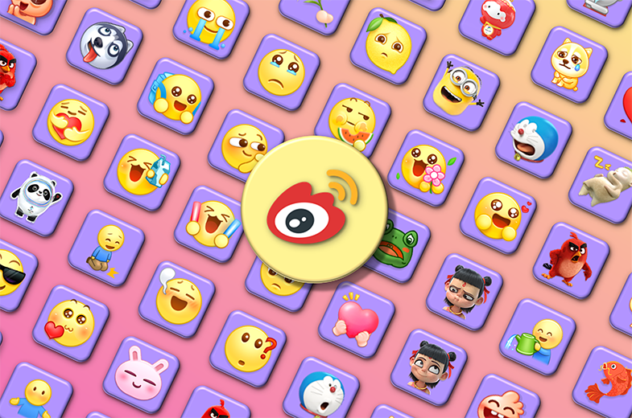

# Weibo Emoji

**English (United Kingdom)** | [中文（简体，中国）](./README_zh-Hans-CN.md)

Weibo, similar to Twitter, is a Chinese microblogging website launched by Sina. **Weibo Emoji** is a repository for saving and sharing most Emoji images that are used/were previously used by the app Weibo. It contains **592 Emoji images**. There is no best, only better. So do you use Weibo? If yes, why not click the following badge[1](#footnote1) and **follow me now**? 😆

## ❗ ATTENTION

> May I have your attention pls? 🔥

1. All Emoji images should never ever be used for commercial purposes. You could add them into your Emoji favourites of chatting apps like WeChat and QQ. You could recommend them to others, and then you deserve a thumb-up. 👍
2. You could find the changelog and a ZIP file to download for the latest version in the [Releases](../../releases) section. The ZIP file contains 2 parts - `original` and `gif`. The former provides the Emoji images combined from Sources 1 and 2. The latter are GIF images converted from the former for your convenience[2](#footnote2). For more info about how the ZIP file's content is generated, please refer to [the README file in the folder `src`](./src/README.md).

## 📋 Folder Instructions

### [img/source_1](./img/source_1) 🙌

Previously, Weibo Emoji had a scheme to extract Emoji images from the specified resource folder of the Weibo's APK file, Weibo HTML5, and Weibo Web. It usually required too much manual work, and has been abandoned from Weibo Emoji V4.0.0.

Weibo officially provides [an `emotions` API](https://open.weibo.com/wiki/2/emotions) to get a list of Weibo's Emoji image info. Weibo Emoji now takes advantage of this API to generate Source 1. Hence, Source 1 contains the Emoji images shown in the Weibo's Emoji panel. It is **Weibo Emoji's primary source**, and uses the official Emoji categories recorded in the list of Weibo's Emoji image info.

### [img/source_2](./img/source_2) 🧐

If you fancy writing a Weibo post with Weibo's Emoji, you may find that some Emoji images are sometimes added to the Emoji panel to reflect a few hot topics in China Net, and that can be removed in a timely manner. Source 2 aims to keep as many of such Emoji images as possible.

One way to get these Emoji images is to use Weibo for Android. Once the latest version of Weibo for Android is installed, launched, and has a user logged in, it will save Emoji resources in its app data folder. The general location is `/storage/emulated/0/Android/data/com.sina.weibo/files/sina/weibo/storage/photoalbum_emotion/emotion`. You do not even need the ROOT permission for access. Hence, you can also extract these images on your own. What I have done to save your time is to categorise them using a specific strategy.

### [src](./src) 🚀

Previously, generating a new release requires completing some steps manually, including but not limited to downloading sources, categorising sources, and converting Emoji images to GIF format. It's absolutely a pain in the arse. Then why not automate the steps? This thought reminds me some words that the supervisor of my MS project for Computing Science used to say.

> This is what you learn Computing Science for - automation.[3](#footnote3) 👨‍🔧

The helper scripts are designed to make it more convenient to generate a new release. For more info, please refer to [the README file in this folder](./src/README.md).

There is much more for you to explore. Hope you will enjoy it. 💖

---

[1.](#source1) The badge showing the number of followers on Weibo is powered by [Substats](https://github.com/spencerwooo/Substats). 👍

[2.](#source2) It seems that GIF images could have better compatibility, especially with WeChat (for iPhone/iPad) and QQ, when adding to the Emoji favourites.

[3.](#source3) Don't catch me out! The sentence has its context.
